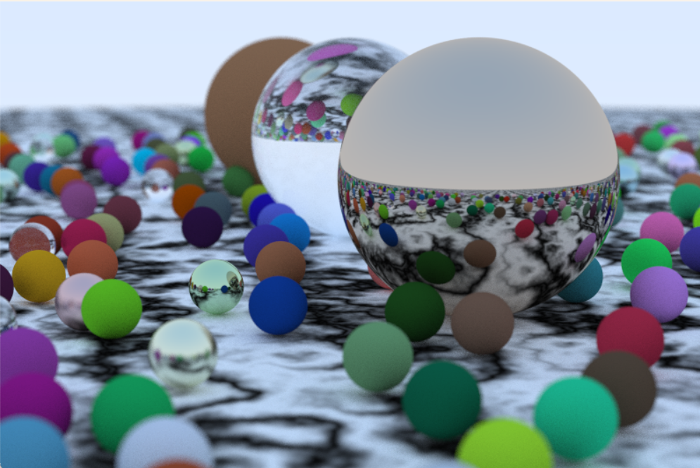
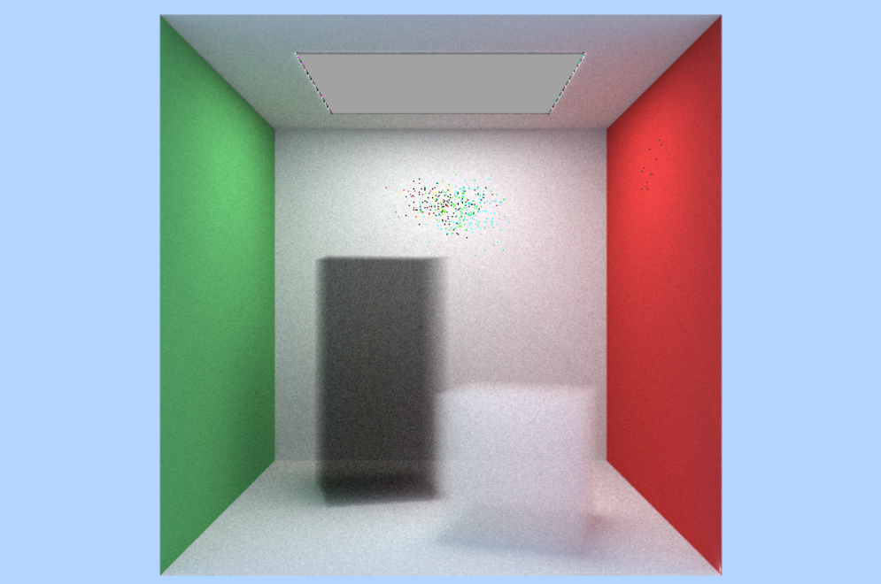
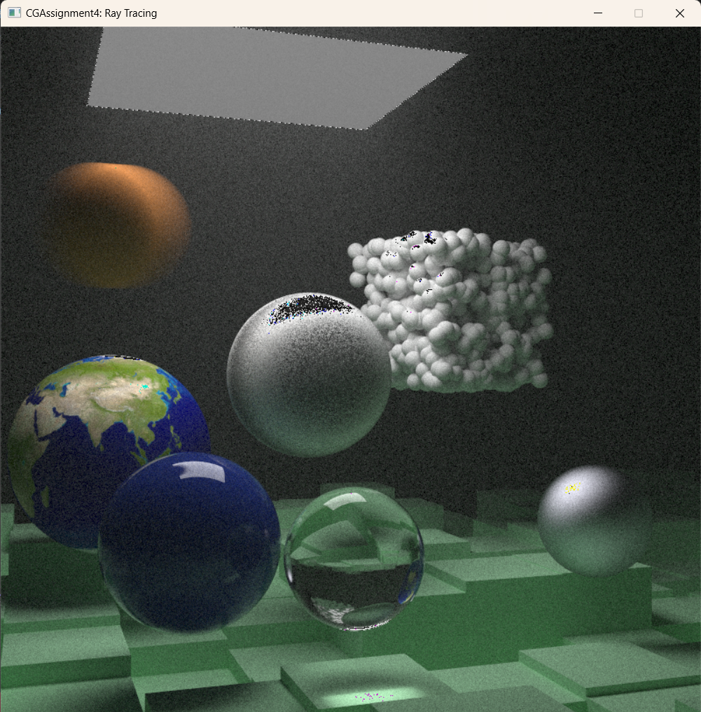
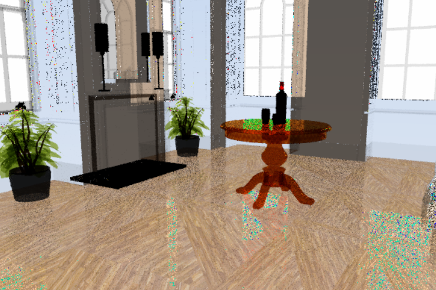
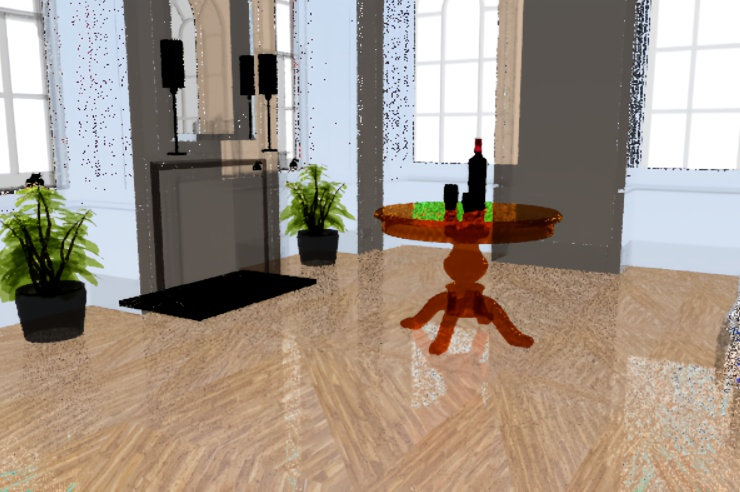
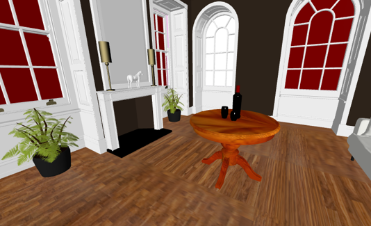

# 光线追踪
## 中山大学计算机图形学期末大作业

- github：[https://github.com/Zhangzhw58/CGAssignment4](https://github.com/Zhangzhw58/CGAssignment4)
### 运行环境

Windows + Visual Studio 2022
c++ 实现，依赖库GLM2

### 项目结构

- src: 项目主要代码，实现了光线追踪的主要功能
- image: 在项目中的场景中用到的图片文件
- scene: .obj模型文件，可加载不同的场景
- show_image: 一些运行结果图

### 环境配置

请按`readme2.pdf`配置好运行环境

配置好后将`scene`文件夹放入`build`和`build/Release`文件夹中

### 运行参数

`src/main.cpp`中:

- aspect_ratio = 3.0 / 2.0; // 图像长宽比
- gWidth = 500; // 图像宽度
- samples_per_pixel = 500;  // 每像素点采样数，值越大图像效果越好，运行时间越长
- scene_choice = 0; // 场景选择，目前支持(0~9)，0为默认最终场景

`src/TRD.h`中:

- background = color(0.5, 0.7, 1.0); // 背景颜色，浅蓝色
- max_depth = 50; // 最大漫反射次数

### 效果展示

- 小球

- 烟雾

- 整体效果

- 加载.obj模型（每像素点采样数 = 5）

- 滤波后

- 对比图（采用https://imagetostl.com/在线加载）

